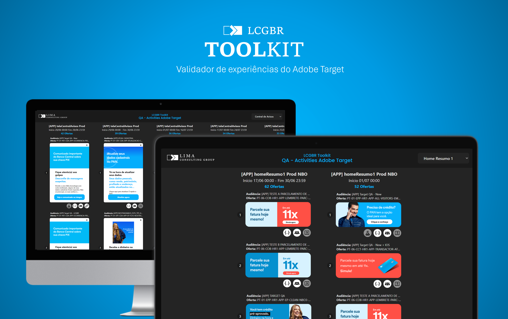
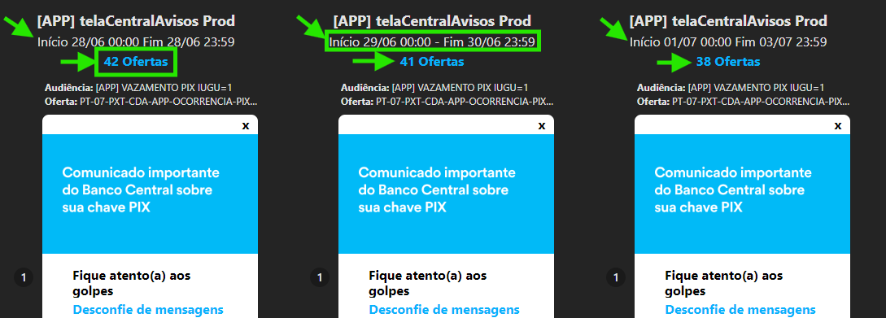
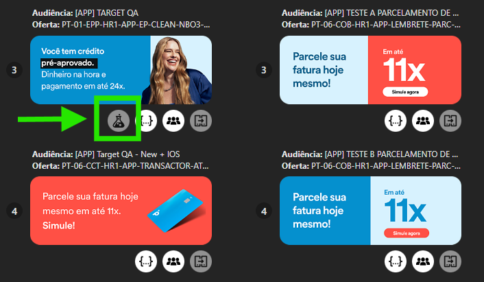
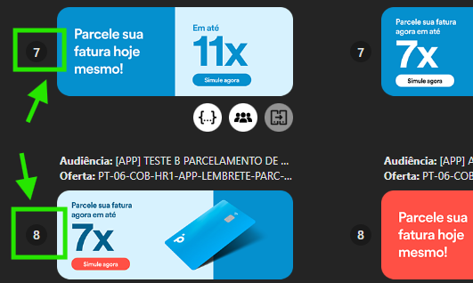
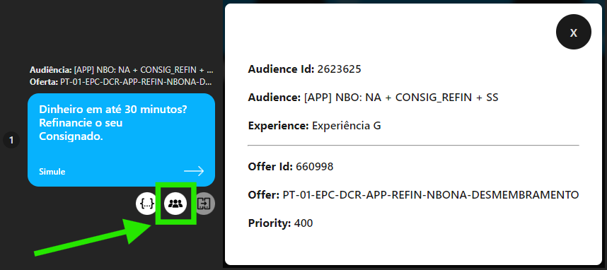
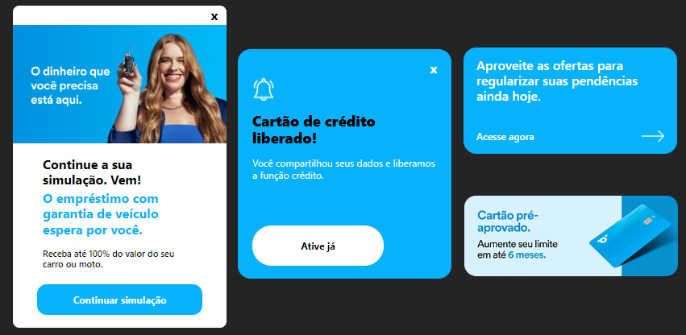

# LCGBR TOOLKIT
## Descrição
Este projeto faz parte do **Toolkit** da [Lima Consulting Group](https://www.limaconsulting.com/), que tem o intuito de oferecer uma caixa de ferramentas completa para seus clientes, proporcionando diversas soluções em um único ambiente. A primeira funcionalidade disponibilizada neste toolkit é o **"Validador de experiências do Adobe Target"**.

## Objetivo
O **Validador de experiências do Adobe Target** é uma aplicação web que tem o objetivo de facilitar as etapas de QA (Quality Assurance), fornecendo uma ferramenta intuitiva que permita visualizar, testar e validar de maneira eficiente e visual as experiências criadas no Target.

## Funcionamento
A aplicação apresenta uma interface amigável em que os usuários podem acessar os dados disponibilizados pela Adobe via API do Target. 

As principais funcionalidades incluem a renderização das ofertas e atividades, para que o usuário possa navegar e revisar todas essas experiências em um ambiente controlado. O usuário também pode acessar facilmente todo o conteúdo do JSON que compõe o banner das ofertas. Isso é feito de maneira organizada e legível, proporcionando uma compreensão clara das ofertas disponíveis.

Além disso, possui recursos para selecionar um espaço específico, o que permite ao usuário visualizar não apenas a atividade live desse espaço, mas também todas as atividades agendadas associadas a ele. Isso simplifica significativamente o trabalho operacional de QA realizado.

## Principais Ganhos

<details>
  <summary><strong>Visualização de Agendamentos</strong></summary>
  Exibe de forma visual e ordenada todas as atividades agendadas, além de informar quantas ofertas estão cadastradas em cada agendamento.
  
</details>

<details>
  <summary><strong>Identificação de ofertas em QA</strong></summary>
  Fácil identificação das ofertas que estão em processo de QA, atraves de um ícone que sinaliza se uma oferta está em fase de validação.
  
</details>

<details>
  <summary><strong>Priorização de Ofertas</strong></summary>
  Organiza e exibe as ofertas de acordo com a prioridade definida.
  
</details>

<details>
  <summary><strong>Validação do Conteúdo das Ofertas</strong></summary>
  Permite visualizar e validar o conteúdo do JSON atribuído às ofertas.
  
</details>

<details>
  <summary><strong>Validação Precisa de Audiências</strong></summary>
  Permite verificar se a audiência foi corretamente atribuída às ofertas, garantindo a precisão das campanhas.
  
</details>

<details>
  <summary><strong>Validação de Links</strong></summary>
  Oferece a funcionalidade de testar e navegar por links externos associados às ofertas. Também diferencia visualmente deep links de links externos.
  
</details>

<details>
  <summary><strong>Interface Dinâmica</strong></summary>
  Visualize as ofertas em seus diversos formatos e estilos, com uma aparência idêntica aos banners exibidos aos clientes.
  
</details>

## Demonstração
https://github.com/marcelo-mls/banco-pan-qa-target-frontend/assets/102492818/90877048-bfec-4c2d-b4f7-7c02f8331189

## Requisitos Técnicos

<table>
  <tr>
    <th width="110px" rowspan="2">Frontend</th>
    <th width="110px"><a href="https://react.dev/" target="_blank">React</a></th>
    <th width="180px"><a href="https://styled-components.com/" target="_blank">Styled-Components</a></th>
   </tr>
  <tr>
    <th></th>
    <th></th>
  </tr>
  <tr>
    <th width="110px" rowspan="2">Backend</th>
    <th width="180px"><a href="https://nodejs.org/pt" target="_blank">Node.js</a></th>
    <th width="180px"><a href="https://expressjs.com/pt-br/" target="_blank">Express</a></th>
   </tr>
  <tr>
    <th></th>
    <th></th>
  </tr>
</table> 

<details>
  <summary><strong>Frontend</strong></summary>

### Tecnologias
O frontend deste projeto foi desenvolvido utilizando:

- `React`: Uma biblioteca `JavaScript` de código aberto para criar interfaces de usuário, que permite o desenvolvimento de aplicações web escaláveis e reativas.
- `Styled-Components`: Uma biblioteca que permite escrever estilos `CSS` de forma mais dinâmica e modular, utilizando JavaScript para estilizar componentes React.

Além disso, foram utilizadas as seguintes dependências de desenvolvimento:
- `Eslint`: Ferramenta de linting para manter um código JavaScript consistente e de alta qualidade.
- `Vite`: Uma ferramenta de construção de aplicações web rápida e minimalista que utiliza ESM (ECMAScript Modules) nativo para desenvolvimento de frontend.

Essas tecnologias foram escolhidas para proporcionar uma experiência de desenvolvimento moderna, eficiente e escalável para o projeto.

### Iniciando
1. Clone o repositório
2. Instale as dependências, com `npm i`
3. Inicie o servidor com `npm run dev`
>Aviso: O frontend estará disponível na porta **5173**. Certifique-se de acessar esta porta para visualizar a aplicação.

</details>

<details>
  <summary><strong>Backend</strong></summary>

[Repositório do backend do projeto](https://github.com/marcelo-mls/banco-pan-qa-target-api)

O backend deste projeto foi desenvolvido em `Node.js` com `Express` e interage com as APIs da Adobe.

Ele realiza requisições HTTP para obter informações sobre atividades, ofertas e audiências dentro do ambiente do Adobe Target. Posteriormente, ele processa, manipula e organiza os dados recebidos, mesclando, ordenando e refinando os resultados conforme necessário. Esses dados são então disponibilizados de forma mais organizada e estruturada através de uma outra API HTTP para consumo externo.

Em suma, o projeto atua como uma ponte entre as APIs do Adobe Target e outros sistemas, entregando informações de maneira mais acessível e organizada.

### Tecnologias
Este projeto foi desenvolvido utilizando `Node.js` juntamente com as seguintes tecnologias e bibliotecas:

- `Express`: Utilizado como framework web para criar e gerenciar as rotas da API, facilitando o desenvolvimento de aplicativos web e APIs RESTful.
- `Cors`: Usado para habilitar o controle de acesso HTTP, permitindo que este aplicativo web seja acessado por outros domínios.
- `Dotenv`: Utilizado para carregar variáveis de ambiente a partir de um arquivo .env, facilitando a configuração de informações sensíveis, como chaves de acesso e segredos do cliente.

Além disso, foram utilizadas as seguintes dependências de desenvolvimento:

- `Nodemon`: Ferramenta de desenvolvimento usada para monitorar as alterações nos arquivos do projeto e reiniciar automaticamente o servidor quando necessário durante o desenvolvimento.
- `Eslint`: Utilizado como uma ferramenta de linting para manter um código JavaScript consistente e de alta qualidade.

Essas tecnologias e bibliotecas foram escolhidas para oferecer uma base sólida e eficiente para o desenvolvimento da aplicação, garantindo desempenho e facilidade de manutenção.

### Iniciando
1. Clone o repositório
2. Instale as dependências, com `npm i`
4. Informe as variáveis de ambiente
3. Inicie o servidor com `npm run dev`
>Aviso: Certifique-se de acessar corretamente a porta informada nas variáveis de ambiente para testar a aplicação.

### Variáveis de Ambiente
As variáveis de ambiente são configuradas para garantir a segurança da aplicação. Elas armazenam informações sensíveis ou configurações específicas que não devem ser expostas diretamente no código-fonte.

Abaixo estão as principais variáveis de ambiente utilizadas neste projeto:

- API_PORT: Porta na qual o servidor da API estará disponível durante o desenvolvimento.
- TENANT_ID: Identificador do tenant do cliente.
- API_KEY: Chave de API para autenticação nas APIs da Adobe.
- HEADER_ACCEPT_V2: Tipo de conteúdo aceito para API v2 do Adobe Target.
- HEADER_ACCEPT_V3: Tipo de conteúdo aceito para API v3 do Adobe Target.
- CLIENT_ID: ID do cliente para autenticação na Adobe.
- CLIENT_SECRET: Segredo do cliente para autenticação na Adobe.
- CLIENT_SCOPE: Escopos de permissão necessários para acessar recursos específicos.

Importante lembrar de criar um arquivo `.env` e preencher com as variáveis de ambiente conforme modelo do arquivo `.env.example`

```env
API_PORT=3001
TENANT_ID=
API_KEY=
HEADER_ACCEPT_V2=application/vnd.adobe.target.v2+json
HEADER_ACCEPT_V3=application/vnd.adobe.target.v3+json
CLIENT_ID=
CLIENT_SECRET=
CLIENT_SCOPE=
```

#### Documentação
Para mais detalhes sobre como configurar essas variáveis e utilizá-las corretamente, consulte a documentação relacionada:
- [Authenticate and access Experience Platform APIs](https://experienceleague.adobe.com/en/docs/experience-platform/landing/platform-apis/api-authentication#authentication-for-each-session)
- [Configure authentication for Adobe Target APIs](https://experienceleague.adobe.com/en/docs/target-dev/developer/api/configure-authentication)
- [Adobe Target Admin and Reporting APIs](https://developer.adobe.com/target/administer/admin-api/#tag/Offers)

### Rotas
> Todas as rotas retornam JSON.
> Em caso de sucesso, o status de resposta é 200 (OK).
> Lembre-se de informar os parâmetros adequados

- #### Atividades
`GET`: /activities/
>Retorna uma lista de todas as atividades.

`GET`: /activities/:activityId
>Retorna os detalhes de uma atividade específica com base no seu ID.

- #### Audiências
`GET`: /audiences/
>Retorna uma lista de todas as audiências.

`GET`: /audiences/:audienceId
>Retorna os detalhes de uma audiência específica com base no seu ID.

- #### Ofertas
`GET`: /offers/:offerId
>Retorna os detalhes de uma oferta específica com base no seu ID.

- #### Espaços
`GET`: /space/clean/:spaceName
>Retorna todo o conteúdo de um espaço, incluindo atividades, ofertas e audiências.

</details>
